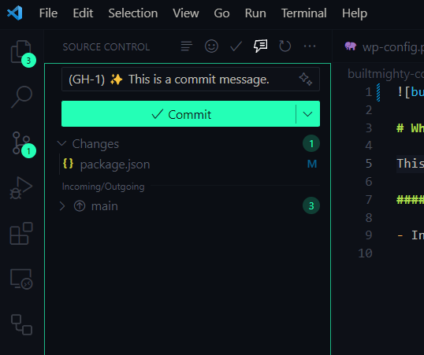

# What is it?

This extension is an extension made to formalize git commit messages for Built Mighty developers.

# Building

To build, run:

```
npm run compile
```

And then:

```
vsce package 1.0.0
```

#### **1.0.0**

- Initial release
